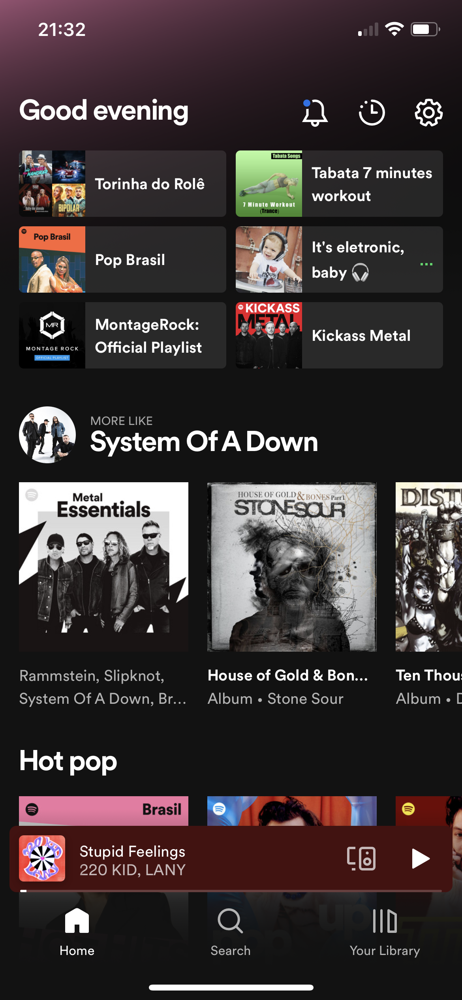

# SpotifyClone

## Sobre o projeto

Esse projeto é um clone de app do Spotify e tem como objetivo ser um material de estudo e eu decidi seguir essa abordagem de fazer a cópia de um aplicativo já existente para que eu pudesse focar mais no aprendizado das tecnologias e conhecimentos. As telas escolhidas foram: Home, Search e o Player de Música, com essas telas é possível abordar muitos dos componentes do UIKit que serão muito úteis na minha revisão sobre ViewCode.

## Tecnologias e Técnicas

As tecnologias e técnicas que eu escolhi me aprofundar com esse projeto foram:

- **Arquitetura VIP:** no mercado se fala bastante da utilização de uma arquitetura limpa para o desenvolvimento de aplicativos e durante os meus estudos eu vi várias referências sobre o VIP, por isso decidi usar ele como arquitetura do meu projeto para que eu pudesse entender com clareza as vantagens e desvantagens dessa arquitetura.

- **Coordinator:** esse é um padrão de projeto muito interessante, pois ele tirar uma das responsabilidades da ViewController que é a apresentação de novas, dessa forma evitamos ainda mais a criação das Massive View Controllers.

- **Dependency Injection:** esse é um design pattern que assimila muito dos conceitos do SOLID e favorece a testabilidade do nosso código como um todo, como também reduz a probabilidade de criação de bugs em nosso projeto e facilita na hora de trocar a implementação de alguma dependência.

- **SOLID:** manter os princípios do SOLID sempre em mente é uma das melhores ferramentas para manter o seu código o mais manutenível possível.

- **Gerenciamento de dependências:** em um pequeno projeto e de baixa complexidade talvez não faça sentido utilizar outras dependências, mas quando ele começa a escalar é provável que irá surgir a necessidade de adicionar outras dependências que irão auxiliar no processo de desenvolvimento do aplicativo e para isso saber como funciona o CocoaPods e o SPM (Swift Package Manager) é sem dúvidas um conhecimento muito precioso.

- **ViewCode e Autolayout programático:** no desenvolvimento para iOS temos dois frameworks muito sólidos que são o UIKit e SwiftUI, e quando utilizamos o UIKit existe duas formas de criar uma tela, com Storyboards ou programaticamente, caso você opte pela segunda forma conhecer ViewCode e Autolayout programático é imprescíndivel.

- **Unit Testing, UI Testing e TDD:** testar sua aplicação do início ao fim é o melhor método para manter a qualidade do software e entender como esses conceitos são aplicados no desenvolvimento iOS é um conhecimento que tenho como meta de aprendizado.

## Telas escolhidas

  
  
  

